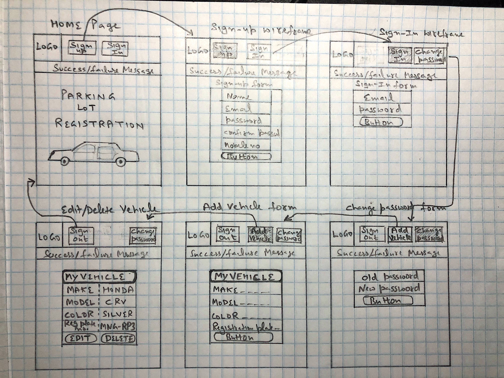

# Parking Lot Registration - client 

### Repository link: https://github.com/khalsaniwas/parking-lot-registration-client

### Description

This is a user interface where users can interact to sign-up and create accounts and register their vehicles. Users can interact with application through input forms and button. Users can add and edit their vehicles with clicks. Data is sent back to backend application through api and gets stored in database. Users can create, delete, update and get vehicles.

## parking-lot-registration (backend api)

### Repository link: https://github.com/khalsaniwas/parking-lot-registration

## Link to deployed sites

### Production site link:
### Development site link:

## Technologies used

Github
Atom
Bootstrap
Handlebars
javascript
visual studio code
Terminal
web browser
dev tool
css
html
ajax
jquery

## Technologies used

## Unsolved problems

## Wire frame

## Planning

## Development story

## User Stories

Vehicle registration User stories
* [x] As a user, I want to get home page with logo, so that i can see welcome text.
* [X] As a signed in user, I want to see my vehicle listing, so that I can see them all in one place.
* [x] As a signed in user, I want to add my vehicle, so that I can register it.
* [ ] As a signed in user, I want to edit my vehicle, so that I can update vehicle information.
* [X] As a signed in user, I want to delete my vehicle.

user signup stories
* [x] As a user, I want to click on sign-up button, so that i can sign-up with email, password, name, mobile phone number.
* [x] As a user , I want to show a success message after clicking  sign-up button, so that i can see if sign-up is successful.
* [x] As a user, I want to show a failure message after sign-up, so that i can see if sign-up failed.
* [x] As a user, I want to click on sign-in button, so that i can sign-in to the app.
* [x] As a user , I want to show a success message after sign-in, so that i can see if sign-in is successful.
* [x] As a user, I want to show a failure message after sign-in, so that i can see if sign-in failed.
* [x] As a user, I want to click on change-password button, so that i can change my password by entering my old password and new password.
* [x] As a user , I want to show a success message after change-password, so that i can see if change-password is successful.
* [x] As a user, I want to show a failure message after clicking change-password button, so that i can see if change-password failed.
* [x] As a user, I want to click on sign-out button, so that i can sign out of app.
* [x] As a user, I want to show a success message after clicking sign-out, so that i can see if sign-up is successful.
* [x] As a user, I want to show a failure message after clicking sign-out button, so that i can see if sign-out  failed.
* [x] As a new user, I want to see only Sign-up and sign-in button
* [x] As a user, I want to activate sign-out and change-password button after sign-in
* [x] As a user, I want to disable signup and sign-in button after sign-in
* [x] As a user, I want to activate sign-up and sign-in after sign-out and disable change-password and sign-out button.

## Tasks

Developers should run these often!

- `grunt nag` or just `grunt`: runs code quality analysis tools on your code
    and complains
- `grunt make-standard`: reformats all your code in the JavaScript Standard Style
- `grunt <server|serve|s>`: generates bundles, watches, and livereloads
- `grunt build`: place bundled styles and scripts where `index.html` can find
    them
- `grunt deploy`: builds and deploys master branch

## [License](LICENSE)

1. All content is licensed under a CC­BY­NC­SA 4.0 license.
1. All software code is licensed under GNU GPLv3. For commercial use or
    alternative licensing, please contact legal@ga.co.
